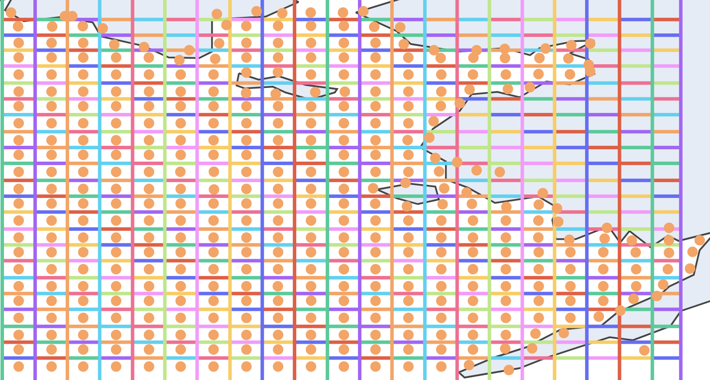
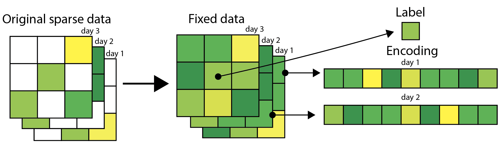

# Algaerithms


## Introduction

The National Oceanic and Atmospheric Administration (NOAA) closely monitors the health of the Bering Sea using a variety of biological metrics, one of which is chlorophyll levels. Chlorophyll is an indicator of Phytoplankton abundance, an important food source for juvenile fish and an indicator of overall ocean health. Chlorophyll levels are monitored via satellite, but the data contains large gaps due to high cloud cover in the Bering Sea. Sparse data translates to less information for scientists and policymakers to use when assessing fish stock health and setting catch quotas for commercial fisheries.

We attempt to fill some of these gaps in sparse chlorophyll data using a Recurrent Neural Network (RNN) model. We evaluated our performance using mean absolute percentage error (MAPE). Our implementation achieved a top MAPE score of 18% on our testing set. In other words, our model is able to predict chlorophyll values to within 18% of the true value on average.

Throughout the project, we collaborated with scientists at NOAA to obtain data, learn about the dynamics behind chlorophyll changes in the Bering Sea, and better understand the potential benefits of being able to fill sparse chlorophyll data.

## Data processing

Processing the data was the most challenging part of the project. We had access to data of daily Bering Sea chlorophyll levels, ocean temperature, sea ice levels, and ocean depth for the past 19 years. Data was summarized over regions and associated with a mean longitude and latitude coordinate. Before this data could be used to train a model, a significant amount of processing needed to be done.

The first step was to translate the data from longitudinal and latitudinal coordinates into array indices that preserved the spatial relationship between points. To do this, we project the data onto a grid and then map the position in the grid to an index in an array.


_Visualization of grid projection._

Next, we generated training data from our very sparse dataset. To generate usable training data, we followed a similar approach to Fan et. al, fixing missing values with the average of nearby regions within time windows. Filling missing values at this step is necessary because we can’t feed our model missing values. We need to always be able to pass a full encoding. 

After fixing as many missing values as possible, we generate training and testing data by using original data as labels, and the data in previous time periods (filled and original) as the input data for the model. We use data from past days and nearby regions as our model input.



## Results

To evaluate our ability to fill in missing data, we use MAPE. This gives us a measurement of how close our predicted chlorophyll value is to the real value measured via satellite. We were able to reach a MAPE of 18% with our RNN architecture and 22% with our FFN model on our training datasets. 

Due to the limitations of data fixing, we are not able to fill in missing values for extremely sparse time periods (No satellite chlorophyll measurements over a month for a given region). On average, we are able to fill in over half of all missing values with our model.


## Setup

```
python3 -m venv env
source env/bin/activate
pip install -U pip
pip install -r requirements.txt
```
This creates the virtual environment and installs project dependencies.


## Inspecting data

Run `python visualize.py <MM/DD/YYYY> [null]`

This will visualize the chlorophyll data for a particular day. Providing "null" will show the cloud-covered points.
